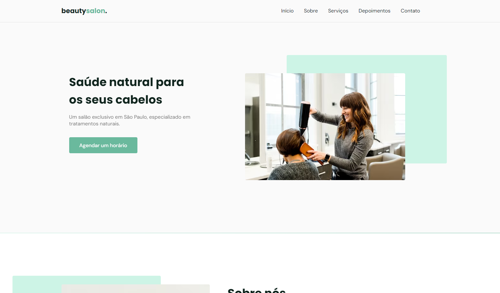

<h1 align="center">NLW 6 Origin</h1>

  
  
  
  

  <a href="#-tecnologias">Tecnologias</a>&nbsp;&nbsp;&nbsp;|&nbsp;&nbsp;&nbsp;
  <a href="#-projeto">Projeto</a>&nbsp;&nbsp;&nbsp;|&nbsp;&nbsp;&nbsp;
  <a href="#-layout">Layout</a>&nbsp;&nbsp;&nbsp;

  

<h4 align="right">
  
  [GitHub Pages](https://gabrielcenteiofreitas.github.io/estudos-rocketseat-nlw6_origin/)
</h4>
 

## 🚀 Tecnologias

Esse projeto foi desenvolvido com as seguintes tecnologias:

- HTML
- CSS
- JavaScript
- Figma

## 💻 Projeto

Projeto de uma Landing Page de uma empresa fictícia desenvolvido durante o evento NLW 6 feita com o objetivo de treinar e aprimorar habilidades.

## 🔖 Layout

Você pode visualizar o layout do projeto através [DESSE LINK](https://www.figma.com/community/file/1009807319507822993).
